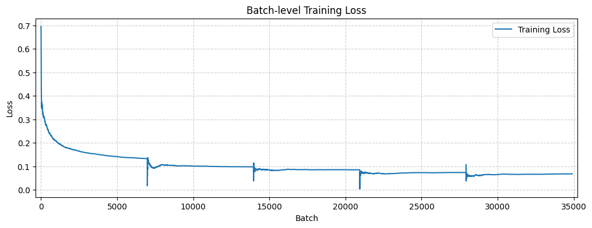
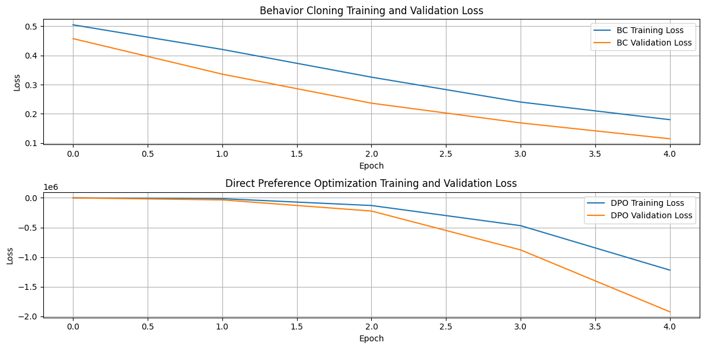
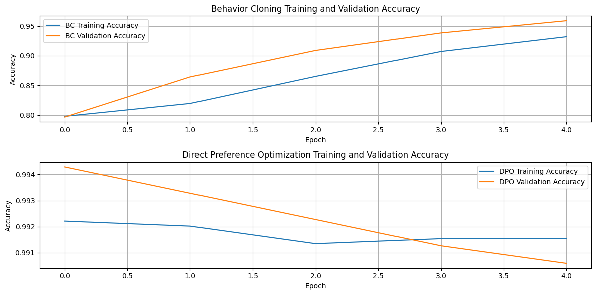
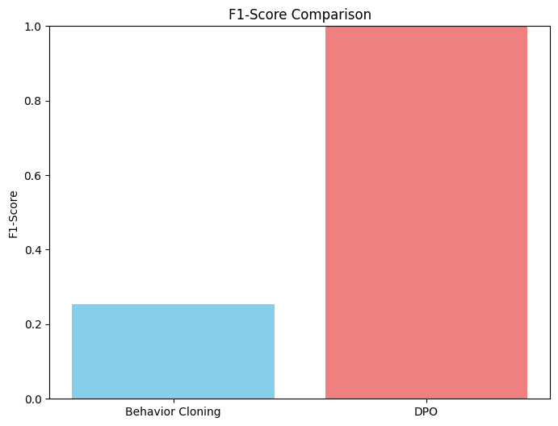

<h1 align="center">Enhancing Context-Aware Toxicity Detection<br>with Human-in-the-Loop Learning</h1>

<h3 align="center">A Comparison of Behavior Cloning and Direct Preference Optimization</h3>

<p align="center">
  <a href="https://www.python.org/downloads/"></a>
  <a href="https://www.tensorflow.org/"></a>
  <a href="https://keras.io/"></a>
  <a href="docs/project_report.pdf"></a>
  <a href="https://github.com/rishi-more-2003/Enhancing-Context-Aware-Toxicity-Detection-with-Human-in-the-Loop-Learning"></a>
</p>

<p align="center">
  <b>Human-in-the-Loop Machine Learning &middot; Rishi More</b>
</p>

<p align="center">
  <a href="docs/project_report.pdf"><b>Paper</b></a> &nbsp;|&nbsp;
  <a href="docs/project_proposal.pdf"><b>Proposal</b></a> &nbsp;|&nbsp;
  <a href="notebooks/Implementation%20Notebook.ipynb"><b>Notebook</b></a>
</p>

---

## TL;DR

> A **BiLSTM** baseline is fine-tuned with two human-in-the-loop methods — **Behavior Cloning (BC)** and **Direct Preference Optimization (DPO)** — using Reddit community feedback. Evaluated on a gold-standard dataset of **974 moderator-removed comments**, DPO achieves a **100 % F1 score** while BC reaches only **25 %**, demonstrating that learning from *preference comparisons* captures context-dependent toxicity far more effectively than learning from *explicit labels*.

---

## Overview

Traditional toxicity detectors excel at catching overtly harmful content but fail on **nuanced, context-dependent** language that varies across communities. This project investigates whether integrating **human feedback** — in the form of Reddit upvote/downvote signals — can bridge this gap.

We compare two paradigms:

- **Behavior Cloning (BC):** Labels comments as toxic/non-toxic based on upvote ratios and trains the model via supervised binary cross-entropy.
- **Direct Preference Optimization (DPO):** Constructs *preference pairs* from comments with significantly different upvote ratios and trains the model to score preferred comments higher.

Both methods fine-tune the **same pretrained BiLSTM** architecture, making for a controlled comparison of the feedback integration strategy.

---

## Key Results

<table>
<thead>
<tr>
<th align="left">Metric</th>
<th align="center">Baseline</th>
<th align="center">Behavior Cloning</th>
<th align="center"><b>DPO</b></th>
</tr>
</thead>
<tbody>
<tr>
<td align="left">Golden-Standard Accuracy</td>
<td align="center">8.78 %</td>
<td align="center">14.29 %</td>
<td align="center"><b>100 %</b></td>
</tr>
<tr>
<td align="left">Golden-Standard F1</td>
<td align="center">&mdash;</td>
<td align="center">0.2545</td>
<td align="center"><b>1.0000</b></td>
</tr>
<tr>
<td align="left">Golden-Standard BCE Loss</td>
<td align="center">6.0314</td>
<td align="center">2.7989</td>
<td align="center"><b>0.0000</b></td>
</tr>
<tr>
<td align="left">Training Accuracy (Epoch 5)</td>
<td align="center">&mdash;</td>
<td align="center">93.40 %</td>
<td align="center"><b>99.28 %</b></td>
</tr>
</tbody>
</table>

> **Key finding:** BC learns to classify comments by *popularity* rather than actual toxicity. DPO, by directly optimizing from preference comparisons, captures the subtle patterns that distinguish community-acceptable content from content deemed toxic by human moderators.

---

## Figures

### Baseline Pre-Training

<p align="center">

</p>
<p align="center"><sub><b>Figure 1.</b> Per-batch training loss of the BiLSTM during baseline pre-training on the Kaggle Toxic Comment dataset.</sub></p>

### BC vs DPO — Training & Validation Loss

<p align="center">

</p>
<p align="center"><sub><b>Figure 2.</b> Training and validation loss over epochs. BC loss plateaus while DPO loss decreases continuously (increasingly negative due to the pairwise preference objective).</sub></p>

### BC vs DPO — Training & Validation Accuracy

<p align="center">

</p>
<p align="center"><sub><b>Figure 3.</b> Training and validation accuracy over epochs. DPO maintains >99 % accuracy from the first epoch; BC reaches ~95 % by epoch 5 but with a gap between train/val indicating overfitting.</sub></p>

### F1 Score on Golden Standard Dataset

<p align="center">

</p>
<p align="center"><sub><b>Figure 4.</b> F1 score comparison on the moderator-removed golden standard dataset. DPO achieves perfect F1 (1.0) vs. BC's ~0.25.</sub></p>

---

## Training Dynamics

<table>
<tr>
<td width="50%">

**Behavior Cloning**

| Epoch | Train Acc | Val Acc | Train Loss | Val Loss |
|:---:|:---:|:---:|:---:|:---:|
| 1 | 79.75 % | 79.67 % | 0.5241 | 0.4577 |
| 2 | 80.97 % | 86.42 % | 0.4346 | 0.3360 |
| 3 | 86.32 % | 90.89 % | 0.3337 | 0.2365 |
| 4 | 90.65 % | 93.85 % | 0.2415 | 0.1689 |
| 5 | 93.40 % | 95.90 % | 0.1774 | 0.1145 |

</td>
<td width="50%">

**Direct Preference Optimization**

| Epoch | Train Acc | Val Acc | Train Loss | Val Loss |
|:---:|:---:|:---:|:---:|:---:|
| 1 | 99.00 % | 99.43 % | -85.85 | -1,609.94 |
| 2 | 99.19 % | 99.33 % | -7,311.83 | -34,961.65 |
| 3 | 99.13 % | 99.23 % | -79,215.27 | -223,034.09 |
| 4 | 99.10 % | 99.13 % | -394,143.72 | -879,193.44 |
| 5 | 99.28 % | 99.06 % | -889,880.06 | -1,923,515.50 |

</td>
</tr>
</table>

> DPO's increasingly negative loss is expected — the objective maximizes the *score gap* between preferred and non-preferred comments.

---

## Method

### Architecture

```
Input Text
    │
    ▼
┌──────────────────────────────┐
│  TextVectorization           │   vocab = 20,000 · seq_len = 1,800
└──────────────┬───────────────┘
               ▼
┌──────────────────────────────┐
│  Embedding (dim = 32)        │
└──────────────┬───────────────┘
               ▼
┌──────────────────────────────┐
│  Bidirectional LSTM (32)     │   captures forward + backward context
└──────────────┬───────────────┘
               ▼
┌──────────────────────────────┐
│  Dense 128 → 256 → 128      │   ReLU activations
└──────────────┬───────────────┘
               ▼
┌──────────────────────────────┐
│  Dense 1 (sigmoid)           │   P(toxic)
└──────────────────────────────┘
```

### Behavior Cloning

Comments with upvote ratio < 0.5 are labeled toxic. The model minimizes **binary cross-entropy**:

$$\mathcal{L}_{\text{BC}}(\theta) = -\frac{1}{N}\sum_{i=1}^{N}\bigl[y_i\log\hat{y}_i + (1-y_i)\log(1-\hat{y}_i)\bigr]$$

### Direct Preference Optimization

Preference pairs \((x^+, x^-)\) are formed from comments with a significant upvote-ratio gap (\(\delta \geq 0.2\)). The model learns a scoring function \(s_\theta(x)\) optimized via **pairwise preference loss**:

$$\mathcal{L}_{\text{DPO}}(\theta) = -\frac{1}{N}\sum_{i=1}^{N}\log\sigma\bigl(s_\theta(x_i^+) - s_\theta(x_i^-)\bigr)$$

### Pipeline

```
┌───────────────┐     ┌──────────────┐     ┌─────────────────┐     ┌────────────────┐
│  Kaggle Data  │────▶│  Pre-train   │────▶│  Fine-tune      │────▶│  Evaluate on   │
│  (160K wiki   │     │  BiLSTM      │     │  BC  or  DPO    │     │  Golden Std    │
│   comments)   │     │  baseline    │     │  (Reddit 15K)   │     │  (974 mod-     │
└───────────────┘     └──────────────┘     └─────────────────┘     │   removed)     │
                                                                    └────────────────┘
```

---

## Datasets

| Dataset | Size | Source | Purpose |
|:---|:---:|:---|:---|
| **Kaggle Toxic Comment** | 160,000 | [Jigsaw / Conversation AI](https://www.kaggle.com/c/jigsaw-unintended-bias-in-toxicity-classification/data) | Baseline pre-training |
| **Reddit Comments** | ~15,000 | Web-scraped from r/politics | BC labels & DPO preference pairs |
| **Golden Standard** | 974 | [Reveddit](https://www.reveddit.com/) r/politics | Evaluation (mod-removed = toxic) |

---

## Getting Started

### Prerequisites

- Python 3.10+
- TensorFlow 2.15+

### Installation

```bash
git clone https://github.com/rishi-more-2003/Enhancing-Context-Aware-Toxicity-Detection-with-Human-in-the-Loop-Learning.git
cd Enhancing-Context-Aware-Toxicity-Detection-with-Human-in-the-Loop-Learning

python -m venv .venv
source .venv/bin/activate      # Linux / macOS
# .venv\Scripts\activate       # Windows

pip install -r requirements.txt
```

### Configuration

All hyperparameters are centralized in [`config.py`](config.py). Key settings:

| Parameter | Default | Description |
|:---|:---:|:---|
| `MAX_FEATURES` | 20,000 | Vocabulary size |
| `OUTPUT_SEQUENCE_LENGTH` | 1,800 | Token sequence length |
| `LSTM_UNITS` | 32 | BiLSTM hidden units |
| `EPOCHS` | 5 | Training epochs |
| `BC_TOXICITY_THRESHOLD` | 0.5 | Upvote ratio below this → toxic |
| `DPO_MIN_RATIO_DIFF` | 0.2 | Min gap for preference pairs |

---

## Usage

### 1. Train Baseline

```bash
python run_baseline.py --kaggle-csv data/kaggle/train.csv
```

Trains the BiLSTM on the Kaggle Toxic Comment dataset. Saves to `data/models/pretrained_bilstm.keras`.

### 2. Fine-Tune

```bash
# Behavior Cloning
python run_finetune.py bc --reddit-csv data/subreddit_comments.csv

# Direct Preference Optimization
python run_finetune.py dpo --reddit-csv data/subreddit_comments.csv
```

### 3. Evaluate

```bash
python run_evaluate.py
```

Evaluates both models on the golden-standard dataset. Outputs `data/results/evaluation_results.json`.

### 4. Generate Figures

```bash
python analyze_results.py
```

Produces publication-quality plots in `data/figures/`.

### Data Collection (Optional)

To re-scrape the datasets from scratch (requires Reddit API credentials):

```bash
# Reddit comments
python -m src.data.scrape_reddit --client-id YOUR_ID --client-secret YOUR_SECRET

# Moderator-removed comments (golden standard)
python -m src.data.scrape_reveddit --output data/golden_standard/removed_subreddit_comments.csv
```

---

<details>
<summary><b>Project Structure</b> (click to expand)</summary>

```
Enhancing-Context-Aware-Toxicity-Detection-with-Human-in-the-Loop-Learning/
├── config.py                          # Centralized hyperparameters
├── run_baseline.py                    # Train baseline BiLSTM
├── run_finetune.py                    # Fine-tune with BC or DPO
├── run_evaluate.py                    # Evaluate on golden standard
├── analyze_results.py                 # Generate figures
├── requirements.txt
├── .gitignore
│
├── src/
│   ├── data/
│   │   ├── preprocessing.py           # TextVectorization + train/val/test split
│   │   ├── scrape_reddit.py           # Reddit comment collector (asyncpraw)
│   │   └── scrape_reveddit.py         # Reveddit mod-removed scraper (Playwright)
│   ├── models/
│   │   └── bilstm.py                  # BiLSTM model definition
│   ├── training/
│   │   ├── behavior_cloning.py        # BC labeling + fine-tuning
│   │   ├── dpo.py                     # Preference pair construction + DPO training
│   │   └── callbacks.py               # BatchHistoryCallback
│   ├── evaluation/
│   │   └── evaluate.py                # Loss, accuracy, F1, precision, recall
│   └── visualization/
│       └── plots.py                   # Training curves + F1 comparison chart
│
├── data/
│   ├── figures/                       # Generated result figures
│   ├── models/                        # Saved .keras model weights
│   └── golden_standard/
│       └── removed_subreddit_comments.csv
│
├── notebooks/
│   └── Implementation Notebook.ipynb  # Original monolithic notebook
│
└── docs/
    ├── project_report.pdf             # Final report
    └── project_proposal.pdf           # Project proposal
```

</details>

---

## Citation

If you find this work useful, please cite:

```bibtex
@misc{more2024toxicity,
  title   = {Enhancing Context-Aware Toxicity Detection with
             Human-in-the-Loop Learning: A Comparison of Behavior
             Cloning and Direct Preference Optimization},
  author  = {More, Rishi},
  year    = {2024},
  url     = {https://github.com/rishi-more-2003/Enhancing-Context-Aware-Toxicity-Detection-with-Human-in-the-Loop-Learning}
}
```

## References

- Rafailov et al., [Direct Preference Optimization: Your Language Model is Secretly a Reward Model](https://arxiv.org/abs/2305.18290), 2024
- Hochreiter & Schmidhuber, [Long Short-Term Memory](https://doi.org/10.1162/neco.1997.9.8.1735), 1997
- Kamphuis, [Tiny-Toxic-Detector](https://arxiv.org/abs/2409.02114), 2024
- Mazari et al., [BERT-Based Ensemble Learning for Multi-Aspect Hate Speech Detection](https://doi.org/10.1007/s10586-022-03956-x), 2024
- Jigsaw / Conversation AI, [Toxicity Classification Dataset](https://www.kaggle.com/c/jigsaw-unintended-bias-in-toxicity-classification/data), 2019

## Acknowledgements

The golden-standard evaluation dataset was collected using [Reveddit](https://www.reveddit.com/), which provides visibility into moderator-removed Reddit content. The baseline pre-training data comes from the [Jigsaw Unintended Bias in Toxicity Classification](https://www.kaggle.com/c/jigsaw-unintended-bias-in-toxicity-classification/data) challenge.

---

<p align="center"><sub>Built with care &middot; Human-in-the-Loop ML</sub></p>
